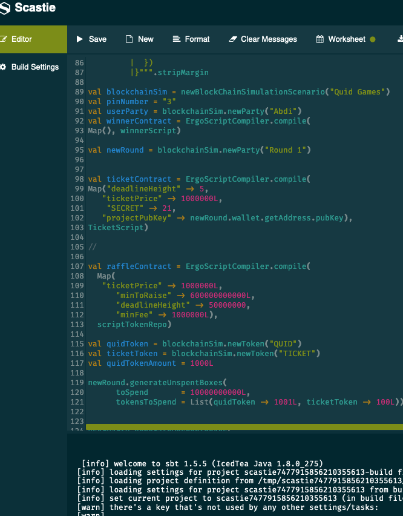

# Blockchain

This repo contains the code for how Quid Games interacts with the blockchain. It was done using ErgoScala and **ergoscript**. We have started our project on the playground using scastie and based used ErgoRaffles concept to implement our contracts. By using scastie and the playground, we have hit some roadblocker, where features were not yet fully implemented such as emitting multiple tokens in a box, which lead to the development of this lacking feature (https://github.com/ergoplatform/ergo-playgrounds/pull/21) within a few hours. This was quite suprising and very helpful and allowed us to continue implementing our use cases.

After successful testing on scastie, we have built the code to run the contract on ergos testnet. We have built a REST endpoint which communicates to our backend and will prepare transactions for betting (first diagram) and checking the winnings (second diagram). 

# Use Case Diagram

## The development

## Useful Links

The Ergo Platform provides a sandbox to run ergoscript code. This can be found [here](https://scastie.scala-lang.org/YCzvl8NBQwa7R0pVI5mHnA).

Additionally, the ergo team provide a few [helpful guides](https://github.com/ergoplatform/ergoscript-by-example).
